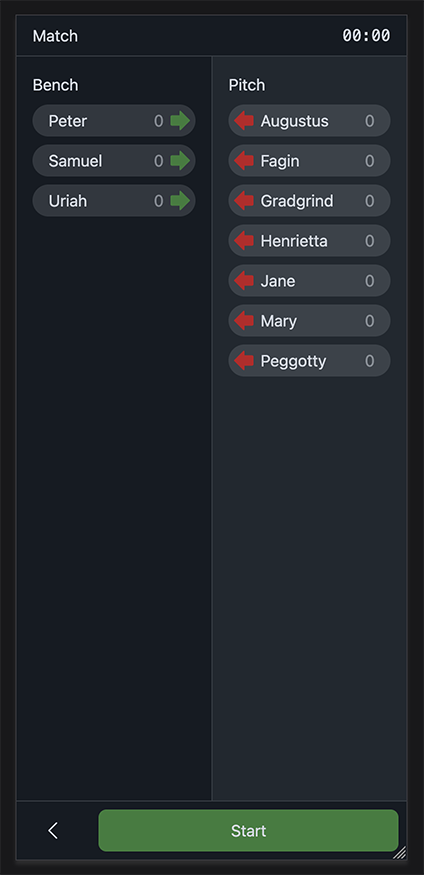

# Skipti

TLDR; App to track subsitutions in team sports



Live demo: https://reinseth.github.io/skipti

This is a small and very simple app that aims help parents and coaches
keep track of the substitutions and playing time in a game of chaos
involving your small kids running around a football pitch (or other
team games) where you're trying your best to keep track of whose on
next, who has played too little, who has been playing a bit too long,
and who was it that just came off?

The app is local storage only, meaning no calls to apis. And state is
continuously stored in the storage, meaning that it will never lose
context if you accidentally navigate away from the app and back again
(or if your screen idles and turns off, which seems to be enough for
most apps nowadays to completely loose state and context leaving the
user confused and annoyed).

The word [skipti](https://en.wiktionary.org/wiki/skipti) is from old
norse, meaning change.

## Technologies

This project is using the following technologies:

- ClojureScript  
  https://clojurescript.org/
- Shadow CLJS  
  https://github.com/thheller/shadow-cljs
- Replicant - DOM rendering  
  https://github.com/cjohansen/replicant
- m1p - i18n  
  https://github.com/cjohansen/m1p
- phosphor-clj - [Phosphor icons](https://phosphoricons.com/) provided as hiccup  
  https://github.com/cjohansen/phosphor-clj/
  
## Developing

Start the development server

```bash
npx shadow-cljs watch app
```

Run the tests

```
npx shadow-cljs watch test
```

Or both at the same time

```
npx shadow-cljs watch app test
```

If you are using Emacs then just jack in cljs and both app and tests will run.
(the test output will be visible in the repl).

The app is then available at http://localhost:9090
